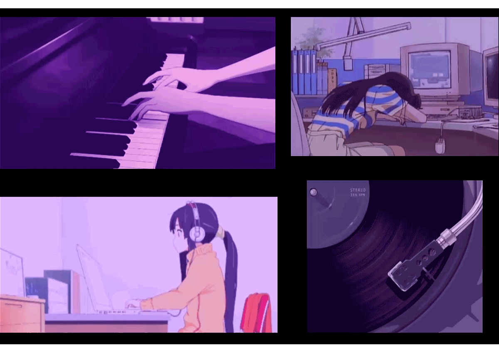

<link rel="stylesheet" type="text/css" href="./styles.css">
<link rel="preconnect" href="https://fonts.googleapis.com">
<link rel="preconnect" href="https://fonts.gstatic.com" crossorigin>
<link href="https://fonts.googleapis.com/css2?family=Montserrat:ital,wght@0,100;0,200;0,300;0,400;0,500;0,800;1,100;1,200;1,300;1,400;1,500&display=swap" rel="stylesheet">

Working at
 

 

Apaixonada por tecnologia, café e um bom livro. 
Sou uma desenvolvedora front-end na constante busca pelo conhecimento, para em breve se tornar uma profissional Full-Stack.

<h1>Sobre mim</h1>

<ul>
<li>❤️ Tenho 19 anos e estou no meu segundo ano do tecnologo em Análise e Desenvolvimento de Sistemas.</li>
<li>🎹 Meu hobby preferido é o piano.</li>
<li>🎵 Amo músicas clássicas.</li>
<li>👨‍💻 Desenvolvedora front-end, lapidando os conhecimentos e adquirindo novos para se tornar full-stack.</li>
<li>💼 Tenho experiência em HTML, CSS e JavaScript, que são as bases do meu trabalho criativo e interativo, e também evoluindo no React.</li>
<li>🎨Experiência com Photoshop a mais de 3 anos.</li>
</ul>

<h1>Tecnologias</h1>

